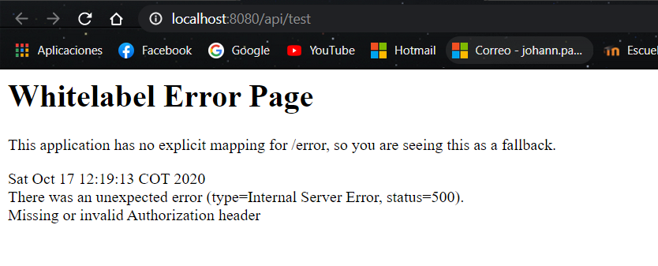
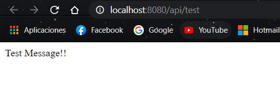

# IETI-LAB8


## Este proyecto fue construido con:

- [Gradle](https://gradle.org/) Administrador de dependencias.

- [Spring](https://spring.io/) Framework para desarrollar aplicaciones web.

- [ReactJS](https://es.reactjs.org/) Framework para aplicaciones web.

## Comandos Backend
  Para compilar el proyecto: ```gradle build```
  
  Para ejecutar el proyecto: ```gradle bootRun```  
      
## Comandos Frontend
  Para descargar las dependencias: ```npm install```
  
  Para ejecutar la aplicación: ```npm start```  
  
  **IMPORTANTE:** Para poder utilizar el aplicativo es necesario instalar las dependencias primero con el comando **npm install**.
  
## Datos de Logeo

**Correo**: test@mail.com

**Contraseña**: password

**Nota**: Se deben utilizar estos datos de logeo, ya que la función de registro aún no está disponible.

## Despliegue de la Aplicación

[Firebase Link 1](https://taskplanner-ieti-lab08.web.app/)

[Firebase Link 2](https://taskplanner-ieti-lab08.firebaseapp.com/)

[](https://mighty-brushlands-30483.herokuapp.com/)

### Verificación de que la aplicación está protegida

[](https://mighty-brushlands-30483.herokuapp.com/api/test)

## Enunciado
El enunciado del laboratorio está disponible [aquí](https://github.com/ieti-eci/2.2-spring-boot-secure-api-react).

## Autor
Johann Sebastian Páez Campos - Laboratorio 08 IETI 17/10/2020

# 2.2 Spring Boot Secure API

**Goals**

* Implement a secure API using the JSON Web Token open standard (RFC 7519). 
* Consume the API from a React JS application.

### Part 1: Implement the API

1. Clone this repository. Compile and run the Spring Boot project.
 
2. Verify that authentication works by issuing the following command from the console:
   
   ```
   curl -H "Content-Type: application/json" -X POST -d '{"username":"xyz","password":"password"}' http://localhost:8080/user/login
   ```
If you don't have the *curl* utility installed, try using the *Postman* application.

3. Open the following url and try to understand the message you get from the server:

http://localhost:8080/api/test

Then try to locate the code fragment where the exception is thrown.



4. Comment the line 13 *@Bean* on the *SpringBootSecureApiApplication* class. Re-run the project and go to the endpoint again:

http://localhost:8080/api/test


                    
Why do you think it works now? Discuss your findings with your classmates.

**Funciona ahora, debido a que no está haciendo la inyección de la configuración de filtros, la cual no permite el acceso cuando el header de autenticación no se encuentra o no lo han incluido**.
                    	
5. Implement the logic to verify the user's credentials on the *UserController* and the *UserServiceImpl* classes.

6. Add the *TaskController* and services implemented on the previous lab. Ensure the endpoints are exposed under the */api* path. 

7. Verify that your implementation secures all the exposed methods under the */api* path in your API.

8. Add the following annotation on top of your *@RequestMapping* annotation on your REST controllers (to avoid the [Cross-origin access restriction](https://developer.mozilla.org/en-US/docs/Web/HTTP/CORS)  )
    
    ````
    @CrossOrigin(origins = "http://localhost:3000")
    ````
    
### Part 2: Consume the API from ReactJS project

1. Open the *Task Planner App* React JS project.

2. Install the axios node package

    ````
     npm install axios --save
    ````

##### Implement an API call in the Login View
    
3. Make a first request to the API to authenticate on the method *componentDidMount()*:

    ```` Javascript
           axios.post('http://localhost:8080/user/login', {
                 username: 'xyz',
                 password: 'password'
             })
                 .then(function (response) {
                     console.log(response.data);
                 })
                 .catch(function (error) {
                     console.log(error);
                 });
    ````
    
4. Save the returned authentication token into the local storage.

5. Implement the logic to validate if the user has a valid token. Then redirect to the Main View.

##### Make other calls to your API

6. Create an instance of the Axios client that contains the token inside the Authorization header

    ```` Javascript
        this.axios = axios.create({
                baseURL: 'http://localhost:8080/api/',
                timeout: 1000,
                headers: {'Authorization': 'Bearer ' + token}
            });
    ````
    
    
7. Make a request to the API with the Axios client instance for retrieving the Tasks List.

8. Create an additional call to Post new Tasks to the API.
